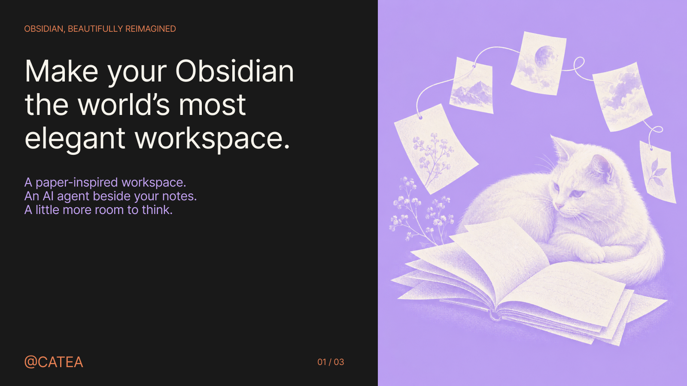
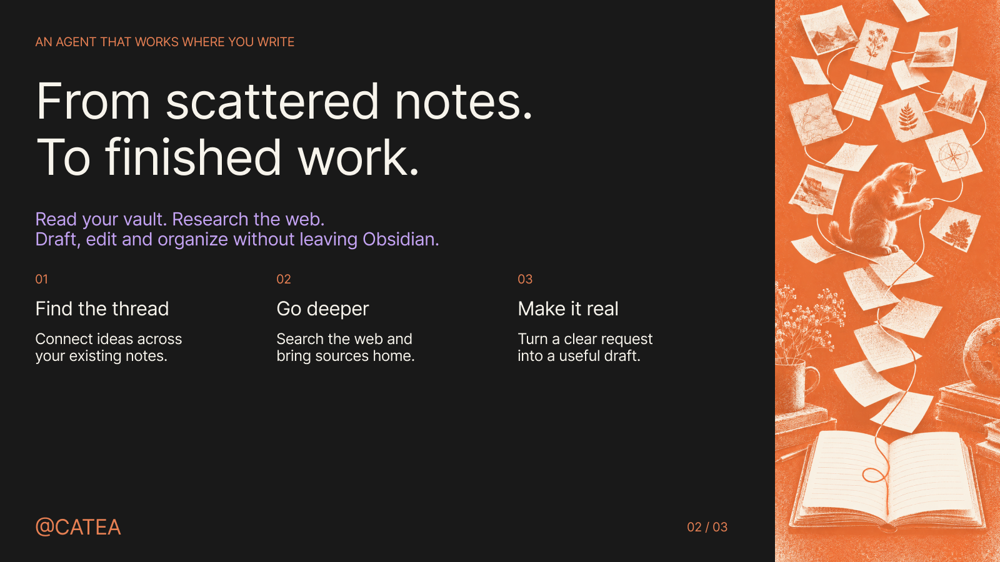
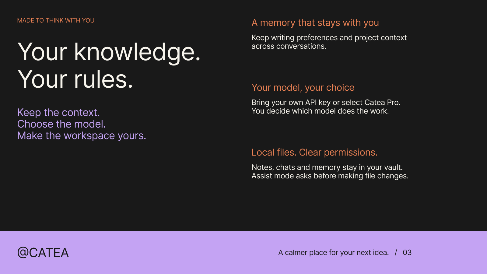

# Catea

**A calmer place to think. An agent to move your ideas forward.**

Catea brings a paper-inspired workspace and an AI agent into Obsidian. Read, research, write, and organize with your notes close at hand. Give the agent a task, guide it while it works, and keep the result in your vault.

[Download Catea](https://github.com/cunyu6666/catea-obsidian-plugin/releases/latest) · [Get started](#get-started) · [Privacy and control](#privacy-and-control) · [Build from source](./CONTRIBUTING.md)

## Make room for better work

Your workspace should make you want to return to it. Catea adds a paper-style editor, coordinated icons, and light, dark, or system appearance. Per-editor zoom lets you settle into a comfortable reading size. The agent lives in the sidebar, next to the material you are working on.

The ambition: **make your Obsidian the world's most elegant workspace.** A place where the interface gives your ideas room to breathe, and the next step is always within reach.

## Give your notes something to do

Catea works with the files in your vault. It can search for relevant material, read it, create a draft, edit an existing note, and organize files through a multi-step workflow.

| Start with | Ask Catea to |
| --- | --- |
| A folder of project notes | Identify unresolved decisions and draft next week's plan. |
| A question worth exploring | Research the web, compare sources with your notes, and write a brief. |
| A collection of fragments | Find the central idea and shape it into a first draft. |
| A draft that needs another pass | Tighten the structure, flag gaps, and revise with your direction. |

Attach files or selected passages to keep the request grounded. Continue giving direction while the agent works, and use separate conversations for separate projects.

## Keep the context that matters

Writing preferences, project context, concepts, and editorial decisions can carry into future conversations through local memory. Working notes and context handoffs help longer tasks continue beyond a single reply.

Choose a persona for the work, add reusable instructions through **Skills**, or connect tools through **MCP servers**. Web research, optional Git history and memory panels, and separately configured image, video, and speech generation extend the workspace when you need them.

## A diary of your days together

Catea can write a daily diary in your AI companion's own voice, based on completed conversations with that persona. Open **Diary** from the ribbon or the **Catea: Open diary** command to browse recent cards, read an entry, and customize the diary name and photo.

After a local calendar day ends, Catea writes one entry per persona that had a conversation. It only records days when Catea was running and there were completed conversations. Unopened days are never backfilled, even if older conversations are later synced into the vault. It uses your current default chat model and consumes model usage; relevant conversation excerpts are sent to that endpoint. Turn off **Write a diary every day** in the diary panel to pause automatic generation. Entries and profile images stay in the vault under `.catea/diary/index.json`.

This feature is in the working source and is not yet in a published release.

## Choose how you connect

- **Bring your own key.** Connect an OpenAI- or Anthropic-compatible service, use a provider preset, or configure OpenRouter. BYOK requires no Catea account; model requests go directly to your configured endpoint.

Hosted Pro subscriptions are not currently offered in the plugin UI while end-to-end service verification is pending. Use your own model API key. Chat model credentials and media-generation credentials are configured separately.

## Get started

Catea requires **Obsidian desktop 1.8.0 or newer**. Mobile is not supported.

1. Download `main.js`, `manifest.json`, and `styles.css` from the [latest release](https://github.com/cunyu6666/catea-obsidian-plugin/releases/latest).
2. Create `<your-vault>/.obsidian/plugins/catea-paper/` and place the three files inside it.
3. Reload Obsidian, then enable **Catea** in **Settings → Community plugins**.
4. Open **Catea settings → BYOK models**, add your provider and API key, and select a model in the sidebar.
5. Open a note and give Catea a task.

Try this:

> Read my project notes, identify what is still undecided, and draft a short plan. Ask me about missing information before filling in the gaps.

Catea supports English and Chinese in the product interface. You can check for updates manually or enable automatic release checks in settings. For source builds and an isolated development installation, see [Contributing](./CONTRIBUTING.md).

## Privacy and control

**Your files remain yours.** Conversations, memory, skills, and vault settings are stored under `.catea/` inside your vault. The agent runs inside Obsidian. Catea has no telemetry.

**Local storage does not mean offline inference.** Relevant prompts, notes, and tool results are sent to the model endpoint you choose. Selecting Catea Pro sends model requests to the Catea-hosted endpoint. Subscription checkout and status checks use the billing service and your subscription email.

**Credentials stay out of vault config.** When OS-backed encryption is available, model API keys and Pro credentials live in an encrypted machine-local store shared across vaults. Otherwise, they use Obsidian secret storage when available, or remain in memory for the current session. `.catea/config.json` contains no API keys or Pro license keys.

**You control actions.** Default **Assist** mode asks before file changes and other sensitive actions. **Full access** skips those approvals. Bash is disabled by default; when enabled, it can access files beyond your vault.

Web search and page reading use Exa, Jina, or DuckDuckGo. Enabled MCP servers receive the inputs needed for their tools. Automatic GitHub release checks run at most once daily and send no notes or keys. Web search and automatic update checks have separate off switches.

An optional, static GitHub Star invitation may appear inside the Catea sidebar at most once per local calendar month. It makes no network requests and can be disabled in **Settings → Catea → Support prompt**.

See [Security](./SECURITY.md) for the complete data, network, and permission model. Older versions created full-vault copies under `.catea/snapshots`; current code removes that obsolete plugin-owned directory on startup and uses tool-scoped file review instead.

## Open source, made to be yours

[Report an issue](https://github.com/cunyu6666/catea-obsidian-plugin/issues) · [Contribute](./CONTRIBUTING.md) · [Changelog](./CHANGELOG.md)

Licensed under [GPL-3.0](./LICENSE). Built on open-source work including CatUI, ANNO, and Tabler Icons. See [third-party notices](./THIRD_PARTY_NOTICES.md) for credits and licenses.
